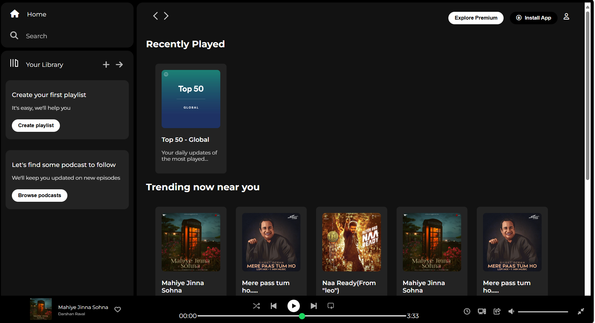

# 🎵 Spotify Clone (HTML + CSS)

A clean and responsive **Spotify landing page clone** built using only **HTML5** and **CSS3**. This project replicates the UI design of Spotify’s web app homepage — including a header, hero section, playlists grid, and footer.

---

## 📸 Screenshot

<p align="center">
  
</p>

---

## 🧰 Tech Stack

- ✅ HTML5  
- ✅ CSS3 (Flexbox & Grid)
- 
---

## 📁 Project Structure
```text
spotify-clone/
│
├── index.html
├── style.css
├── assets.png
└── README.md
|__screenshot.png
```

---

## ✨ Features

- 🎧 Spotify-like UI layout
- 🔍 Navigation bar 
- 🖼️ Hero banner with call-to-action
- 🎼 Playlist/Album grid section
- 📱 Responsive design for mobile and desktop
- 🦶 Clean footer with links and info

---

## 🚀 Getting Started

To view the project locally:

```bash
git clone https://github.com/your-username/spotify-clone.git
cd spotify-clone
open index.html  # or simply drag it into your browser
```
---

## 👨‍💻 Author
Anuj Singal

